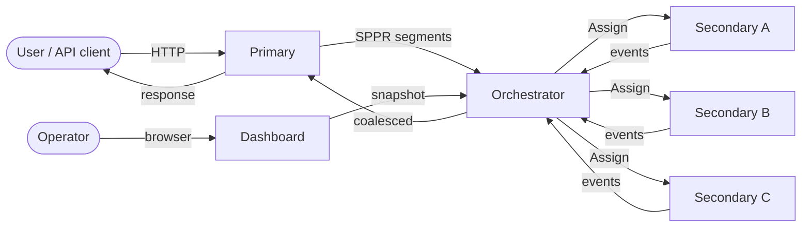

# Distributed Ollama — Documentation

This directory documents the distributed MPI-style Ollama framework built
across phases 0–8.

| Document | Contents |
| -------- | -------- |
| [`overview.md`](overview.md) | System architecture, packages, component diagram |
| [`lifecycle.md`](lifecycle.md) | Node state machine + transition rules |
| [`request-flow.md`](request-flow.md) | End-to-end request sequence from HTTP → response |
| [`operations.md`](operations.md) | Running Primary/Secondary, configuration, dashboard |
| [`examples.md`](examples.md) | Practical examples: configs, curl invocations, code |

The authoritative specification is
[`../../DISTRIBUTED_ARCHITECTURE.md`](../../DISTRIBUTED_ARCHITECTURE.md).
The package-level roadmap and phase status live in
[`../../distributed/README.md`](../../distributed/README.md).

## TL;DR

If `--mode` is not set, none of this is in the hot path — Ollama runs
exactly as it did before.
