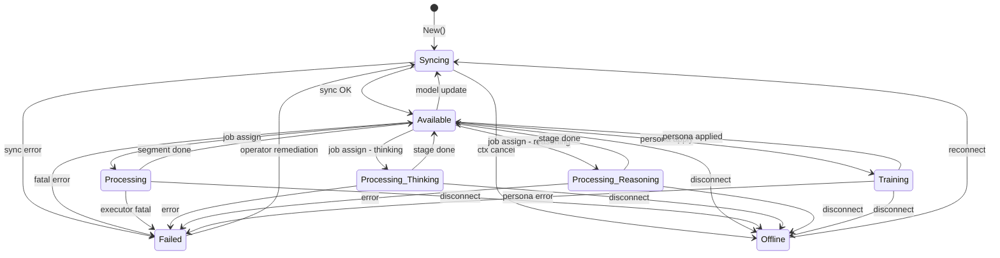

# Node Lifecycle

Secondary nodes transition through a small formal state machine defined
in [`distributed/state`](../../distributed/state/state.go). Only
`Available` nodes receive job assignments.

## States

| State | Meaning |
| ----- | ------- |
| `Available` | Ready to execute jobs |
| `Syncing` | Synchronizing models; not eligible for jobs |
| `Failed` | Sync failure or other error |
| `Offline` | Connectivity lost |
| `Processing-Thinking` | In the thinking phase |
| `Processing-Reasoning` | In the reasoning phase |
| `Processing` | Running a job (no thinking/reasoning) |
| `Training` | Learning a new persona |

## Transition diagram



Idempotent transitions (`from == to`) are accepted as no-ops so callers
that assert "the node is now in state X" don't need to track prior state.

## Listener fan-out

```mermaid
sequenceDiagram
  participant Caller
  participant Machine as state.Machine
  participant L1 as Listener
  participant Pri as transport.Primary

  Caller->>Machine: Transition(Processing)
  Machine->>Machine: validate from→to
  Machine-->>Caller: ok
  Machine-->>L1: listener(from, to)
  L1->>Pri: ReportStateUpdate{From,To}
  Note over L1,Pri: delivery is best-effort;<br/>heartbeat reconciles on failure
```

Listeners run **synchronously** under the Machine's lock, so they must
not call back into the Machine or perform blocking I/O; the distributed
runtime uses its listener to enqueue a `ReportStateUpdate` RPC and
returns immediately.

## Invariants

- `Failed` and `Offline` are "terminal" for the scheduler — those nodes
  are excluded from `AvailableNodes()`.
- Recovery always passes through `Syncing` so model state is
  reconciled before the node re-enters the pool.
- A segment error reported by a Secondary executor does **not** drive
  the node into `Failed`; only fatal node-level faults (sync failure,
  persona failure, transport teardown) do. Segment errors fail the
  enclosing job but leave the node eligible for future work.
