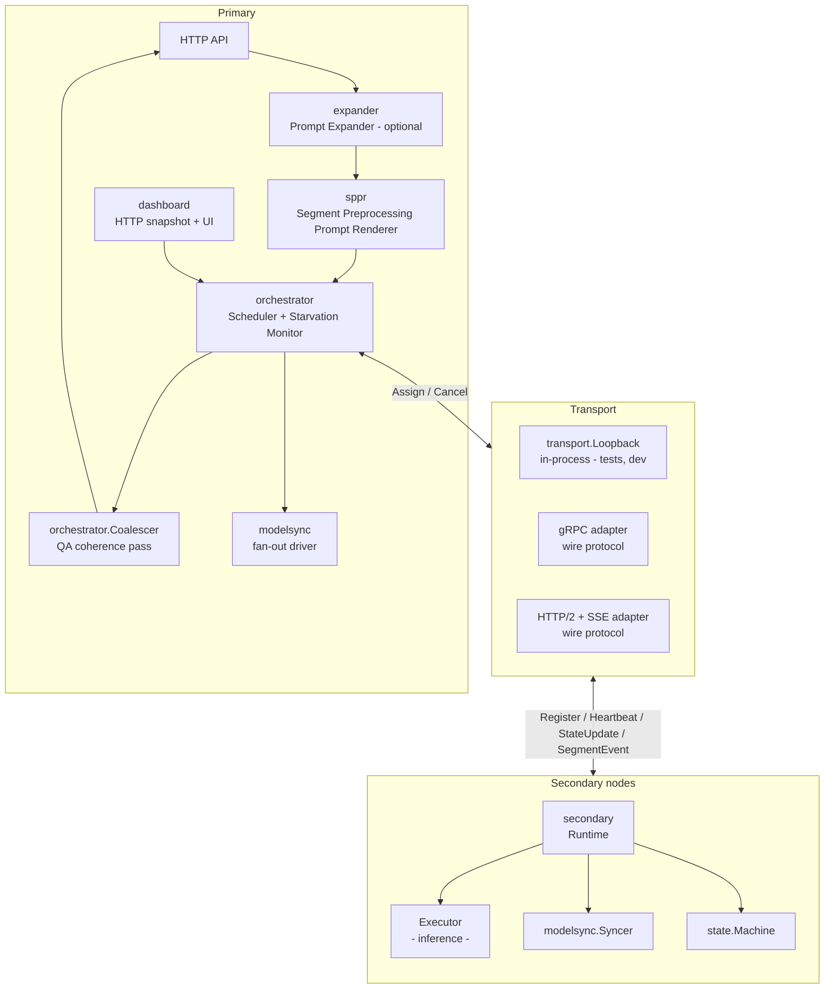
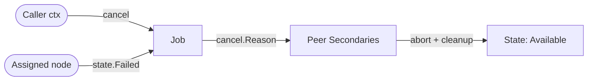
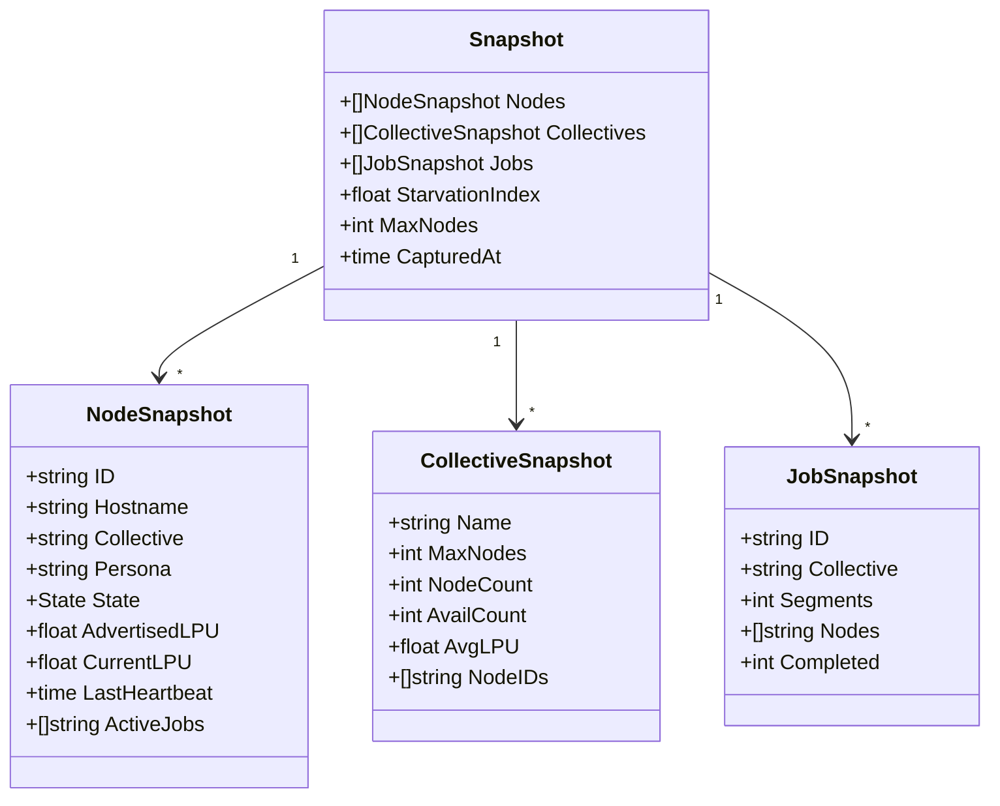

# Architecture Overview

The distributed MPI-style Ollama framework adds a Primary/Secondary
orchestration layer on top of Ollama's existing inference stack. It is
**feature-gated**: unless the operator starts Ollama with `--mode=primary`
or `--mode=secondary` (or sets `OLLAMA_NODE_MODE`), the standalone
`ollama serve` behavior is byte-identical to today's.

## Component diagram



## Packages

| Package | Purpose | Phase |
| ------- | ------- | ----- |
| [`distributed/config`](../../distributed/config) | Typed configuration, personas, YAML loader, env overrides | 1 |
| [`distributed/cancel`](../../distributed/cancel) | Typed cancellation contract (caller-cancel, node-failure) | 1 |
| [`distributed/node`](../../distributed/node) | Node identity (UUID, hostname, collective, advertised LPU) | 2 |
| [`distributed/state`](../../distributed/state) | Formal state machine for Secondary lifecycle | 2 |
| [`distributed/transport`](../../distributed/transport) | Primary ↔ Secondary RPC surface + in-process loopback | 2 |
| [`distributed/secondary`](../../distributed/secondary) | Secondary-mode runtime (sync → available → execute) | 3 |
| [`sppr`](../../sppr) | Segment Preprocessing Prompt Renderer (pipeline stage) | 4 |
| [`expander`](../../expander) | Optional pre-SPPR prompt expander | 4 |
| [`distributed/orchestrator`](../../distributed/orchestrator) | Primary scheduler, starvation monitor, execution, correlation, coalescer | 5 |
| [`distributed/modelsync`](../../distributed/modelsync) | Model fan-out and manifest-diff sync | 6 |
| [`distributed/dashboard`](../../distributed/dashboard) | HTTP snapshot API + single-page operator UI | 7 |
| [`distributed/integration`](../../distributed/integration) | End-to-end tests across every module | 8 |

## Key design choices

- **Separation of concerns** — Primary orchestrates; Secondaries execute.
  The Primary does **not** run inference in collective mode.
- **Fail closed** — malformed SPPR output falls back to single-segment;
  zero available nodes returns the fixed rejection message.
- **Argument over config** — CLI flags win over config-file values.
- **Reuse over rewrite** — inference, pull, and templating are reused
  verbatim from the existing Ollama stack.

## Allocation formula

The orchestrator's scheduler computes the number of nodes to use for a
job using the formula in `DISTRIBUTED_ARCHITECTURE.md §5`:

```
n = min(
  requested_nodes (if supplied),
  ceil(segment_count / concurrency_hint),
  available_nodes_in_collective,
  floor(MaxNodesPerCollective × STARVATION_INDEX),
)
```

- `STARVATION_INDEX` is live, in `[0.1, 1.0]`, driven by a monitor that
  tightens on failures and relaxes on successes.
- Selected nodes are chosen highest-LPU-first and segments are assigned
  round-robin across them.

## Cancellation



Every dispatched job runs under a shared per-job cancel context. Either
the caller cancelling its HTTP request OR any assigned Secondary
transitioning to `Failed` cancels the whole job; peer Secondaries are
signalled via `transport.CancelRequest` and released to the Available
pool.

## Snapshot data model (Dashboard / Phase 7)


