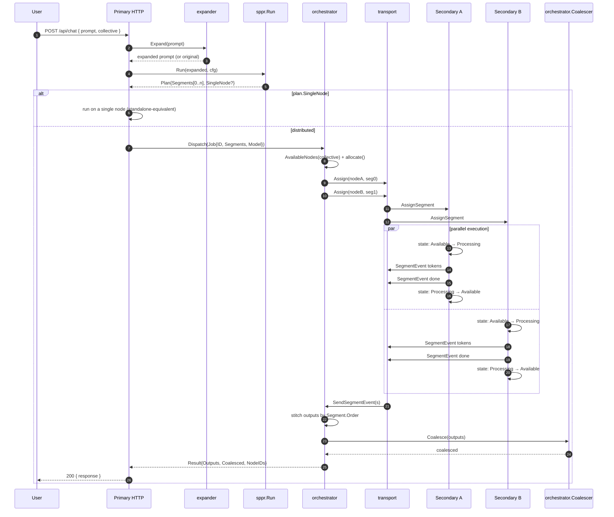
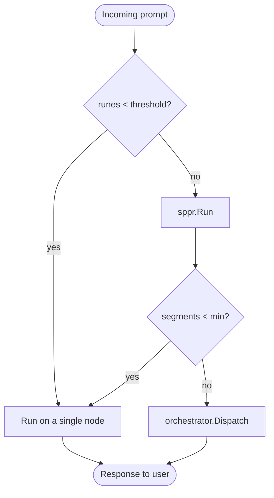
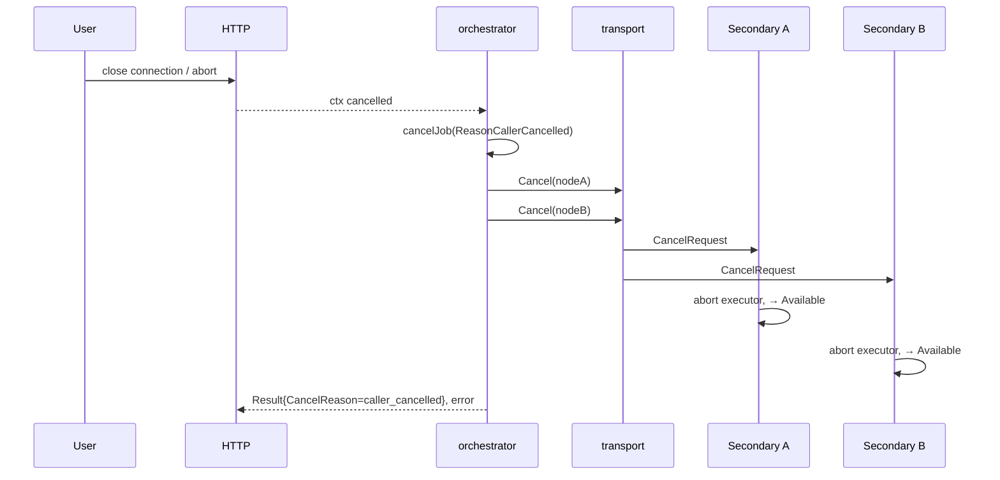
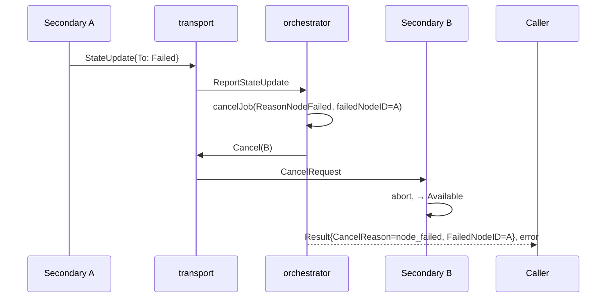

# Request Flow

This document traces a request from the moment the HTTP handler accepts
it through segmentation, distribution, coalescing, and response.

## Happy path — distributed job



## Small-job fallback

Two thresholds (either triggers fallback) are configured in
`DistributedConfig.SmallJob`:

| Field | Default | Meaning |
| ----- | ------- | ------- |
| `prompt_rune_threshold` | 400 | Raw prompts under this many runes skip SPPR entirely |
| `min_segments` | 2 | If SPPR emits fewer than N segments, run on a single node |



Fallback is a **normal success**, not an error — the caller still gets
a response; the request just wasn't sharded.

## Cancellation paths

### Caller cancels



### Node fails mid-job



## Starvation index feedback loop

```mermaid
flowchart LR
  Job -- success --> Monitor[starvation monitor]
  Job -- failure --> Monitor
  Monitor -- recompute --> Index[StarvationIndex\n[0.1, 1.0]]
  Index --> Allocate[orchestrator.allocate]
  Allocate --> Dispatch[Next Dispatch]
  Dispatch --> Job
```

The monitor uses a proportional heuristic: `index = target × (1 − failure_rate) + MinStarvationIndex × failure_rate`,
clamped to `[MinStarvationIndex, MaxStarvationIndex]`.
